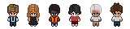

# Pixel Agents

A standalone desktop app that turns your AI coding agents into animated pixel art characters in a virtual office.

Each Claude Code terminal you open spawns a character that walks around, sits at desks, and visually reflects what the agent is doing — typing when writing code, reading when searching files, waiting when it needs your attention.

Inspired by [pixel-agents](https://github.com/pablodelucca/pixel-agents) (VS Code extension), rebuilt as a standalone Electron app.


## Features

- **One agent, one character** — every Claude Code terminal gets its own animated character
- **Live activity tracking** — characters animate based on what the agent is actually doing (writing, reading, running commands)
- **Office layout editor** — design your office with floors, walls, and furniture using a built-in editor
- **Speech bubbles** — visual indicators when an agent is waiting for input or needs permission
- **Sound notifications** — optional chime when an agent finishes its turn
- **Sub-agent visualization** — Task tool sub-agents spawn as separate characters linked to their parent
- **Persistent layouts** — your office design is saved across sessions
- **Diverse characters** — 6 diverse characters.

<p align="center">
  
</p>

## Requirements

- macOS (Terminal.app is used to launch Claude sessions)
- [Claude Code CLI](https://docs.anthropic.com/en/docs/claude-code) installed and configured

## Getting Started

### Install from source

```bash
git clone https://github.com/andywxy1/pixel-agents-app.git
cd pixel-agents-app
npm install
cd webview-ui && npm install && cd ..
npm run build
```

### Run

```bash
npm run start          # build + launch
npm run start:dev      # dev mode (with hot reload for webview)
```

### Package as DMG

```bash
npm run package:mac    # production DMG → release/
```

### Usage

1. Launch the app
2. Click **+ Agent** to spawn a new Claude Code terminal and its character
3. Start coding with Claude — watch the character react in real time
4. Click a character to select it, then click a seat to reassign it
5. Click **Layout** to open the office editor and customize your space

## Layout Editor

The built-in editor lets you design your office:

- **Floor** — Full HSB color control
- **Walls** — Auto-tiling walls with color customization
- **Tools** — Select, paint, erase, place, eyedropper, pick
- **Undo/Redo** — 50 levels with Ctrl+Z / Ctrl+Y
- **Export/Import** — Share layouts as JSON files via the Settings modal

The grid is expandable up to 64×64 tiles. Click the ghost border outside the current grid to grow it.

### Office Assets

The office tileset used in this project is **[Office Interior Tileset (16x16)](https://donarg.itch.io/officetileset)** by **Donarg**, available on itch.io for **$2 USD**.

This is the only part of the project that is not freely available. The tileset is not included in this repository due to its license. To use Pixel Agents with the full set of office furniture and decorations, purchase the tileset and run the asset import pipeline:

```bash
npm run import-tileset
```

The app will still work without the tileset — you'll get the default characters and basic layout, but the full furniture catalog requires the imported assets.

## How It Works

Pixel Agents watches Claude Code's JSONL transcript files to track what each agent is doing. When an agent uses a tool (like writing a file or running a command), the app detects it and updates the character's animation accordingly. No modifications to Claude Code are needed — it's purely observational.

The webview runs a lightweight game loop with canvas rendering, BFS pathfinding, and a character state machine (idle → walk → type/read). Everything is pixel-perfect at integer zoom levels.

## Tech Stack

- **Backend**: TypeScript, Electron, esbuild
- **Frontend**: React 19, TypeScript, Vite, Canvas 2D

## Known Limitations

- **macOS only** — terminal launching uses AppleScript. Windows/Linux support is not yet implemented.
- **Agent-terminal sync** — the way agents are connected to Claude Code terminal instances is not super robust and sometimes desyncs, especially when terminals are rapidly opened/closed or restored across sessions.
- **Heuristic-based status detection** — Claude Code's JSONL transcript format does not provide clear signals for when an agent is waiting for user input or when it has finished its turn. The current detection is based on heuristics (idle timers, turn-duration events) and often misfires — agents may briefly show the wrong status or miss transitions.

## Roadmap

- **Improve agent-terminal reliability** — more robust connection and sync between characters and Claude Code instances
- **Better status detection** — find or propose clearer signals for agent state transitions (waiting, done, permission needed)
- **Community assets** — freely usable pixel art tilesets or characters
- **Agent creation and definition** — define agents with custom skills, system prompts, names, and skins before launching them
- **Desks as directories** — click on a desk to select a working directory, drag and drop agents to move them to specific desks/projects
- **Claude Code agent teams** — native support for [agent teams](https://code.claude.com/docs/en/agent-teams), visualizing multi-agent coordination and communication
- **Git worktree support** — agents working in different worktrees to avoid conflict from parallel work on the same files
- **Cross-platform support** — Windows and Linux terminal launching
- **Support for other agentic frameworks** — [OpenCode](https://github.com/nichochar/opencode), or any agentic experiment you'd want to visualize

## Contributions

See [CONTRIBUTORS.md](CONTRIBUTORS.md) for instructions on how to contribute.

Please read our [Code of Conduct](CODE_OF_CONDUCT.md) before participating.

## Acknowledgements

This project is based on ideas and code from [pixel-agents](https://github.com/pablodelucca/pixel-agents) by Pablo de la Lucca, originally a VS Code extension. This version is rebuilt as a standalone Electron app.

## License

This project is licensed under the [MIT License](LICENSE).
